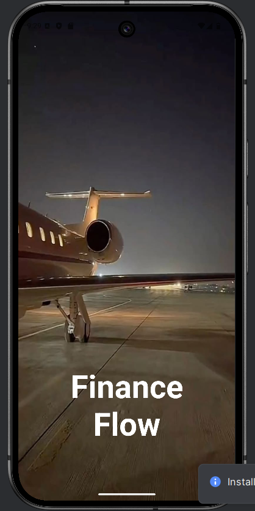

Personal Finance Tracker mobile application using Kotlin that allows users to track their 
income, expenses, and savings. The app should provide an intuitive and simple interface to record 
f
 inancial transactions and analyze spending habits.
 
